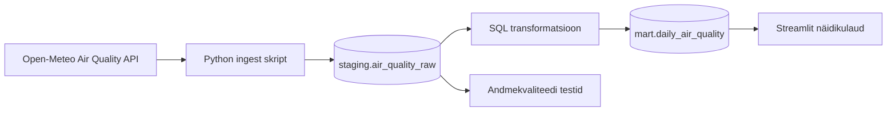

# Õhukvaliteedi märguanne linnadele

## Äriküsimus

Millal võib valitud Eesti linnades (nt Tallinn) õhukvaliteet halveneda ja millised saasteained (PM2.5) ületavad tervislikke piirmäärasid enim?

**Mõõdikud:**
1. Kriitiliste tundide arv päevas (PM2.5 üle 15 µg/m³).
2. Päevane maksimumtase (kõrgeim PM2.5 kontsentratsioon).

## Arhitektuur



## Andmestik

| Allikas | Tüüp | Ajas muutuv? | Roll |
|---------|------|--------------|------|
| Open-Meteo Air Quality API | API | Jah, iga tund | Põhiandmevoog (PM2.5 näitajad) |

## Stack

| Komponent | Tööriist |
|-----------|---------|
| Sissevõtt | Python (urllib, json) |
| Transformatsioon | SQL |
| Andmehoidla | PostgreSQL (pgDuckDB) |
| Näidikulaud | Streamlit |
| Orkestreerimine | Käsitsi käivitatav Python skript |

## Käivitamine

```bash
# 1. Klooni repo ja liigu kausta
git clone <sinu-repo-url>
cd ohukvaliteet-projekt

# 2. Käivita teenused
docker compose up -d --build

# 3. Käivita andmetoru (tõmbab andmed, teeb arvutused ja testid)
docker compose exec pipeline python scripts/run_pipeline.py
```
Näidikulaud on kättesaadav: http://localhost:8501

## Saladused ja konfiguratsioon
Kõik saladused (paroolid, andmebaasi URL-id) on `.env` failis. Repos on ainult `.env.example`.
* `DB_PASSWORD` = praktikum
* `DB_USER` = praktikum

## Andmevoog lühidalt
1. **Sissevõtt** — Pythoni skript teeb päringu Open-Meteo API-sse.
2. **Laadimine** — Andmed laaditakse `staging.air_quality_raw` tabelisse (idempotentselt).
3. **Transformatsioon** — SQL arvutab `mart.daily_air_quality` tabelisse, mitu tundi päevas ületas PM2.5 WHO piirmäära.
4. **Testimine** — 3 andmekvaliteedi testi kontrollivad andmete loogilisust.
5. **Näidikulaud** — Streamlit kuvab tulemused tulpdiagrammil.

## Andmekvaliteedi testid
Projekt kontrollib järgmist:
1. Kas `staging` tabelisse jõudsid andmed (tabel pole tühi).
2. Kas PM2.5 väärtused on loogilised (ei ole negatiivsed).
3. Kas asukoha nimi on korrektselt täidetud (ei ole NULL).

## Kokkuvõte, puudused ja võimalikud edasiarendused
**Kokkuvõte:** Minimaalne andmetoru töötab algusest lõpuni. Andmed liiguvad API-st andmebaasi, sealt tehakse transformatsioonid ja kuvatakse Streamlitis.
**Puudused:** Hetkel on andmetorus ainult üks linn (Tallinn) ja üks saasteaine (PM2.5). Töövoog ei ole veel automatiseeritud (cron/Airflow puudub).
**Mis edasi:** Lisada staatiline asukohtade tabel (seed), et pärida andmeid mitme linna kohta korraga. Lisada juurde PM10 ja osooni näitajad.