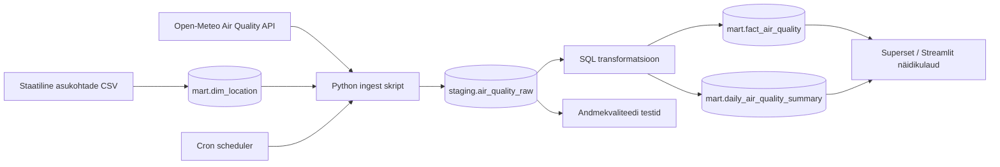

# Arhitektuur

## Äriküsimus

Millal võib valitud Eesti linnades (nt Tallinn, Tartu, Pärnu, Narva) õhukvaliteet halveneda ja millised saasteained (PM2.5, PM10, lämmastikdioksiid, osoon) ületavad tervislikke piirmäärasid enim?

## Mõõdikud

1. **Kriitiliste tundide arv päevas:** Mitu tundi päevas ületab mõni saasteaine (nt PM2.5 või PM10) Maailma Terviseorganisatsiooni (WHO) soovituslikku piirmäära.
2. **Päevane maksimumtase:** Iga linna päeva kõige kõrgem saasteainete kontsentratsioon (µg/m³).
3. **Peamine saasteaine:** Milline näitaja (PM2.5, PM10, NO2, O3) on antud päeval/tunnil kõige kriitilisem.

## Andmeallikad

| Allikas | Tüüp | Ajas muutuv? | Roll |
|---------|------|--------------|------|
| Open-Meteo Air Quality API | Avalik HTTP API | Jah, prognoos uueneb iga tund | Põhiandmevoog — tunnipõhised õhukvaliteedi näitajad |
| `seeds/asukohad.csv` | Staatiline CSV fail | Ei, staatiline | Linnade koordinaadid (laius- ja pikkuskraadid) API päringute tegemiseks |

## Andmevoog

## Andmebaasi kihid

| Kiht | Roll |
|------|------|
| `staging` | Hoiab Open-Meteo API-st saadud toorandmeid (tunnipõhised read) töötlemata kujul. |
| `mart` | Hoiab puhastatud andmeid: staatilist linnade dimensiooni (`dim_location`), tunnipõhist faktitabelit ja päevast koondtabelit, kus on arvutatud piirmäärasid ületavad tunnid. |
| `quality` | Hoiab andmekvaliteedi testide tulemusi (nt kas API tagastas tühje väärtusi). |

## Tööjaotus

| Roll | Vastutus | Täitja |
|------|----------|--------|
| Andmeallika omanik | Kirjutab Pythoni skripti, mis loeb API-st andmeid ja salvestab need `staging` kihti. | Ott Karp |
| Transformatsioonide omanik | Kirjutab SQL skriptid, mis viivad andmed `staging` kihist `mart` kihti ja arvutavad mõõdikud. | Ott Karp |
| Kvaliteedi omanik | Kirjutab SQL testid (nt et PM2.5 ei saa olla negatiivne) ja kontrollib andmete korrektsust. | Ott Karp |
| Näidikulaua omanik | Seadistab Superset või Streamlit näidikulaua ja loob visuaalid äriküsimusele vastamiseks. | Heija-Liis Ristikivi |

## Riskid

| Risk | Mõju | Maandus |
|------|------|---------|
| Open-Meteo API ei vasta või on maas | Andmeid ei saa värskendada ja töövoog katkeb | Pythoni skriptis kasutame `try-except` plokki. Viga logitakse, aga andmebaas ei lähe katki. Näidikulaud näitab viimaseid edukaid andmeid. |
| Algajate tehnilised tõrked (nt Docker ei käivitu) | Projekti arendus venib | Kasutame kursuse baastaseme näidisprojekti (`naidisprojekt-ilmaandmed`) põhja, mis on juba testitud ja töötab. |
| Andmete tõlgendamise keerukus | Raske on öelda, mis on "halb õhk" | Uurime välja lihtsad WHO piirmäärad (nt PM2.5 > 15 µg/m³) ja kirjutame need otse SQL loogikasse (nt `CASE WHEN pm2_5 > 15 THEN 'Halb' ELSE 'Hea' END`). |

## Privaatsus ja turve

Projekt kasutab ainult avalikke õhukvaliteedi andmeid (Open-Meteo). Isikuandmeid ega tundlikku äriinfot ei koguta ega töödelda. 
Andmebaasi kasutajanimed, paroolid ja pordid on defineeritud `.env` failis. Repositooriumisse laetakse ainult `.env.example` fail, päris `.env` fail on lisatud `.gitignore` nimekirja, et saladused ei lekiks GitHubi.
